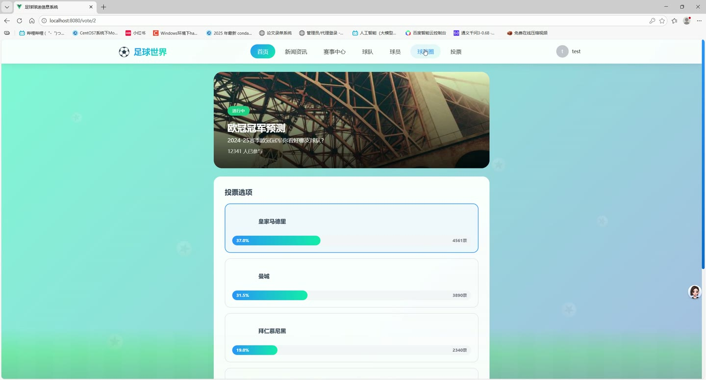
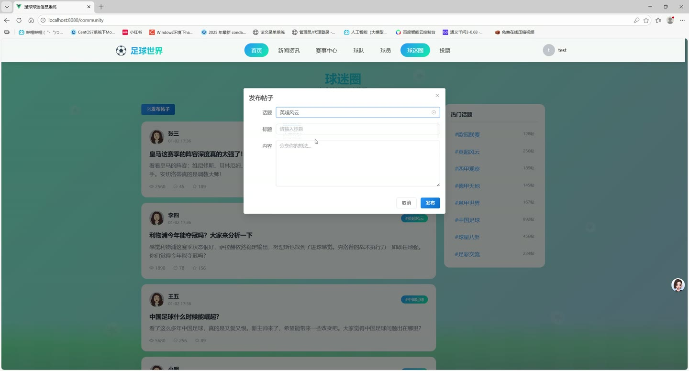
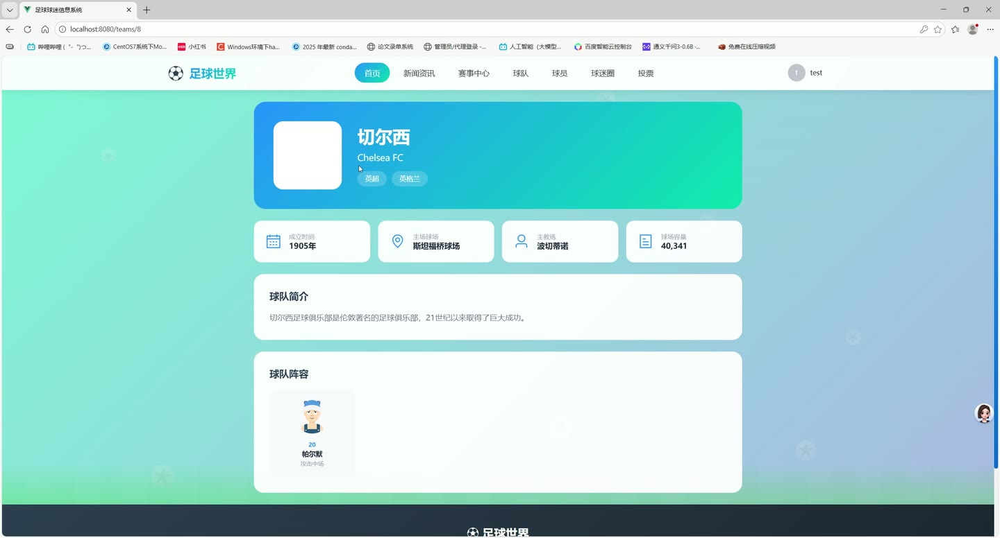

# (附文档)Springboot3+Vue3+MySQL “足球世界”足球新闻及球迷社交系统

**技术栈**：Springboot3、Vue3、MySQL

### 系统简介

“足球世界”是一个前后端分离的足球新闻及球迷社交系统，基于 Spring Boot 3 + Vue 3 架构。系统提供足球新闻资讯、赛程赛果、球队与球员数据、社区论坛、投票互动以及后台管理等核心模块，支持普通用户浏览互动与管理员内容运营两种角色。
 
### 核心功能
 
### 普通用户端

 
- 用户注册与登录：通过用户名/密码注册新账号，登录后获取 JWT Token 进行身份认证。 
- 个人信息管理：修改昵称、头像、邮箱、手机号、性别、主队、个人简介等资料。 
- 密码修改：输入原密码与新密码，安全更新登录密码。 
- 新闻浏览：查看新闻列表，支持按关键词搜索、按分类筛选；点击进入详情页自动增加浏览量。 
- 热门/置顶新闻：首页展示系统推荐的置顶新闻与热门新闻（按浏览量排序）。 
- 赛程赛果查看：浏览比赛列表，支持按赛事名称搜索、按比赛状态（未开始/进行中/已结束）筛选。 
- 即将开始与近期完赛：首页展示即将进行的比赛（按时间升序）和最近结束的比赛（按时间降序）。 
- 球队浏览：查看球队列表，支持按名称/英文名搜索、按所属联赛筛选；点击进入球队详情页。 
- 球员浏览：查看球员列表，支持按名称/英文名搜索、按所属球队或场上位置筛选；详情页展示球员基本信息。 
- 社区帖子浏览：查看社区帖子列表，支持按关键词搜索、按所属话题筛选；详情页自动增加浏览量。 
- 热门帖子：首页展示系统推荐的热门帖子（按点赞数排序）。 
- 我的帖子管理：查看自己发布的所有帖子，支持编辑与删除操作。 
- 发布帖子：选择话题，填写标题、内容和图片，发布新帖子到社区。 
- 话题浏览与关注：查看所有话题列表，支持搜索；关注或取消关注感兴趣的话题。 
- 热门话题：首页展示关注人数最多的热门话题。 
- 评论互动：对新闻或帖子发表评论，支持查看评论列表及子评论（回复）。 
- 删除自己的评论：用户可删除自己发布的评论。 
- 投票参与：查看投票列表，支持按状态筛选；进入投票详情页查看选项及实时百分比，选择选项后提交投票。 
- Banner 轮播：首页展示指定位置（HOME）的活跃 Banner，按排序顺序显示。
 
### 管理员端

 
- 新闻管理：查看所有新闻列表（支持按关键词/分类/状态筛选），发布新新闻，编辑或删除已有新闻。 
- 新闻置顶/热门设置：将指定新闻设置为置顶或热门，控制首页展示优先级。 
- 比赛管理：查看比赛列表（支持按赛事/状态筛选），新增、编辑或删除比赛。 
- 比赛比分录入：为已结束比赛录入主队/客队比分并更新比赛状态。 
- 球队管理：查看球队列表（支持按名称/联赛搜索），新增、编辑或删除球队。 
- 球员管理：查看球员列表（支持按名称/球队/位置搜索），新增、编辑或删除球员。 
- 帖子管理：查看所有帖子（支持按关键词/话题/状态筛选），审核帖子状态（通过/禁用），设置置顶或热门，删除违规帖子。 
- 评论管理：查看所有评论（支持按目标类型/目标ID/状态筛选），审核评论状态，删除违规评论。 
- 话题管理：查看话题列表（支持搜索），新增、编辑或删除话题，设置话题为热门。 
- 投票管理：查看投票列表（支持按状态筛选），创建新投票（含标题、描述、封面、截止时间、是否多选及选项列表）。 
- Banner 管理：查看 Banner 列表（支持按位置筛选），新增、编辑或删除 Banner，设置 Banner 启用/禁用状态。 
- 用户管理：查看用户列表（支持按用户名/昵称搜索），管理用户状态（启用/禁用）。 
- 文件上传：上传图片等文件到指定文件夹，返回可访问的 URL 地址。 
- 文件删除：根据文件 URL 删除已上传的文件。
 
### 技术栈

 后端框架Spring Boot 3 ORMMyBatis-Plus 权限认证JWT Token 密码加密Spring Security Crypto (BCrypt) 前端框架Vue 3 状态管理Pinia 构建工具Vite 数据库MySQL 分页插件MyBatis-Plus Pagination 文件存储本地文件系统
 
### 交付内容

 
- 后端完整源码 
- 前端完整源码 
- 数据库初始化脚本 
- 万字文档

## 界面展示

---

## 获取完整源码 + 万字文档

本仓库为项目介绍页。**完整前后端源码、数据库初始化脚本、万字项目文档**，请加微信 `kangkangcode`，或访问 [codekk.top](http://codekk.top) 获取。

可作课程设计 / 毕业设计参考，支持远程部署调试。